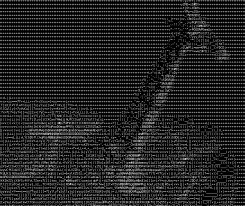
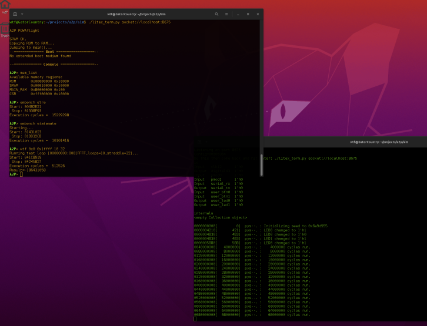
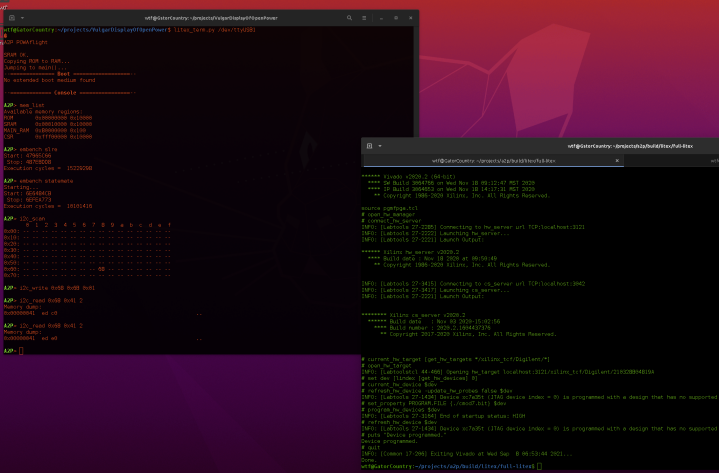

# A2P



## Back to the 90s!

A2P is a mashup of OpenPOWER architecture and VexRiscv, creating a new 32b Power core for experimentation and lightweight designs.

## Status

### Function



* Ops (100+) not thoroughly tested, but running a minimal kernel and partial Litex BIOS in Verilator and on FPGAs.  Likely still
some bugs in CR/XER handling for div/mul(?).

* Need to define supported translation modes.

* SOC builds with Litex; ~~software is built manually and runs from 'ROM' with on-board RAM.~~

    * now running Litex BiOS, coremark, prototype test environment, etc. with async RAM interface on Cmod-A7 ISSI chip.

* Core and SOC run in Verilator/pyverilator.  SOC uses emulated host UART.

### FPGA Implementation

* Currently using Cmod A7-35T board. 

* Needs SOC code update to access external SRAM.  I2C works.



* A lot of LUTs are being used by bypass/GPR write.  Recent analysis (100MHz, Vivado/Artix):

```
cellanal.py

--- cells_ff.txt ---

Total: 1791

IC                              115
decode                          244
execute                         456
regfile                           0
hazards                          38
ALU2                             32
MULDIV                          136
memory                          295
DC                               69
SPR                             239
MSR                              15
writeBack                         1
ibus                             32
dbus                             32
SPINAL _zz_                      87
Total in matched areas         1791

*** >32 bits (93): a2p_i/A2P_WB/inst/IBusCachedPlugin_fetchPc_pcReg_reg ***
*** >32 bits (52): a2p_i/A2P_WB/inst/memory_to_writeBack_MUL_LOW_reg ***
Totals by cells:
    1: 131   131
    2:  16   163
    3:   7   184
    4:   6   208
    5:  18   298
    6:   1   304
    7:   1   311
    8:   5   351
   10:   1   361
   11:   2   383
   26:   1   409
   30:   3   499
   31:   5   654
   32:  31  1646
   52:   1  1698
   93:   1  1791

--- cells_lut.txt ---

Total: 2539

IC                               85
decode                          262
execute                        1758
regfile                           9
hazards                          35
ALU2                              0
MULDIV                          145
memory                          133
DC                                1
SPR                              56
MSR                               0
writeBack                         0
ibus                              1
dbus                              8
SPINAL _zz_                      46
Total in matched areas         2539

*** >32 bits (35): a2p_i/A2P_WB/inst/Hazards_writeBackBuffer_payload_data ***
*** >32 bits (62): a2p_i/A2P_WB/inst/IBusCachedPlugin_fetchPc_pcReg_reg ***
*** >32 bits (34): a2p_i/A2P_WB/inst/MULDIV1_result ***
*** >32 bits (66): a2p_i/A2P_WB/inst/MULDIV_accumulator ***
*** >32 bits (40): a2p_i/A2P_WB/inst/_zz_141_ ***
*** >32 bits (42): a2p_i/A2P_WB/inst/decode_to_execute_RA ***
*** >32 bits (220): a2p_i/A2P_WB/inst/decode_to_execute_RB ***
*** >32 bits (107): a2p_i/A2P_WB/inst/execute_to_memory_BRANCH_CALC ***
*** >32 bits (64): a2p_i/A2P_WB/inst/execute_to_memory_CR_WRITE_imm ***
*** >32 bits (212): a2p_i/A2P_WB/inst/execute_to_memory_DECODER_stageables_49 ***
*** >32 bits (1028): a2p_i/A2P_WB/inst/execute_to_memory_REGFILE_WRITE_DATA ***
*** >32 bits (86): a2p_i/A2P_WB/inst/execute_to_memory_SRC_CR ***
*** >32 bits (37): a2p_i/A2P_WB/inst/execute_to_memory_XER_WRITE_imm ***
*** >32 bits (68): a2p_i/A2P_WB/inst/memory_to_writeBack_MUL_LOW ***
Totals by cells:
    1: 158   158
    2:   1   160
    3:   5   175
    4:   1   179
    5:   5   204
    8:   2   220
    9:   1   229
   17:   1   246
   20:   2   286
   25:   1   311
   31:   1   342
   32:   3   438
   34:   1   472
   35:   1   507
   37:   1   544
   40:   1   584
   42:   1   626
   62:   1   688
   64:   1   752
   66:   1   818
   68:   1   886
   86:   1   972
  107:   1  1079
  212:   1  1291
  220:   1  1511
 1028:   1  2539
```
